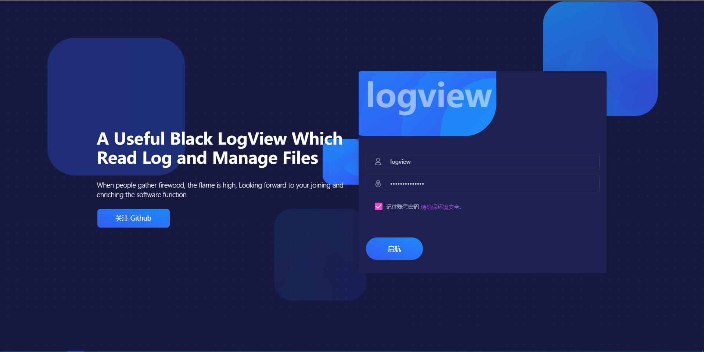
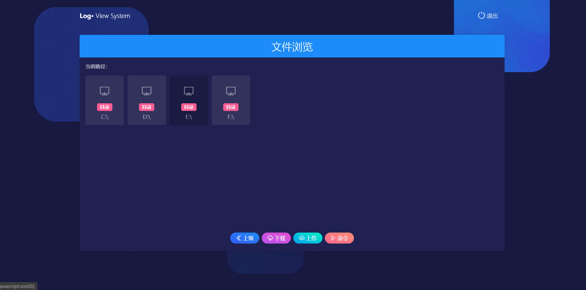
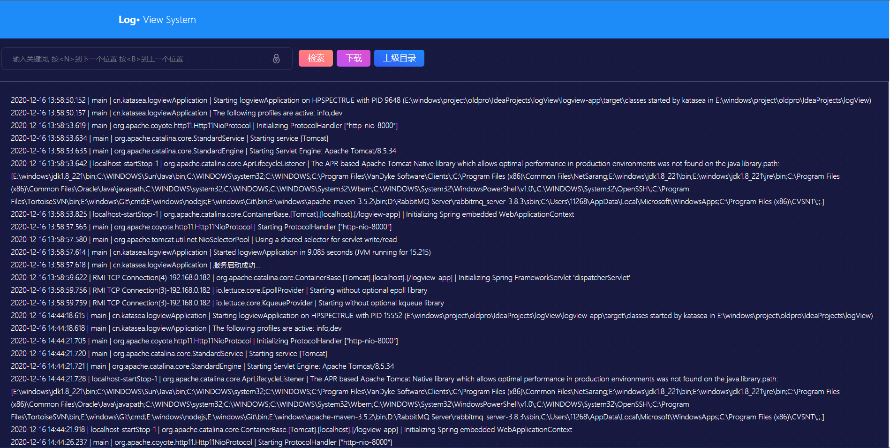

# LogView


建设目标
---------
- [x] 1、浏览应用所在服务器目录<br>
- [x] 2、下载任意文件<br>
- [x] 3、上传任意文件<br>
- [x] 4、查看日志文件并支持检索<br>
- [ ] 5、在线修改相关配置文件<br>
- [ ] 6、在线执行cmd或shell脚本【启动远程服务等】<br>
- [ ] 7、支持多应用合并服务器信息，统一管理<br>
- [x] 8、简易部署，简易配置。<br>
- [x] 9、RSA登录传输加密

界面预览
---------
- 登录页面

- 主页面

- 日志查看



环境依赖
---------
JDK1.8+


部署步骤
---------
- 下载代码 使用maven打包 找个目录放以下文件 这里采用lib包分离模式，方便后续更新
```java
mvn package -Dmaven.test.skip=true
```
- 拷贝config文件夹 并修改配置文件端口，可以不用改。
- 拷贝app/target/lib  app/target/logview-app-*.jar.original
- 写个脚本启动  java -jar logview-app-*.jar.original
```jshelllanguage  
java -Xmx256M -Xms256M -jar -Dfile.encoding=gbk -Dloader.path=./config;./lib  logview-app-v1.0.0.jar.original
```
- 访问 http://localhost:8000/logView


声明
---------


协议
---------
不知道啥协议，反正随便用


